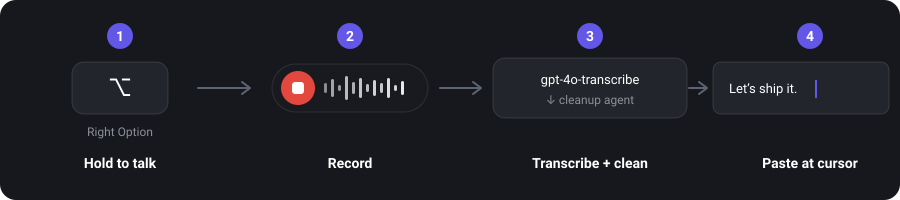
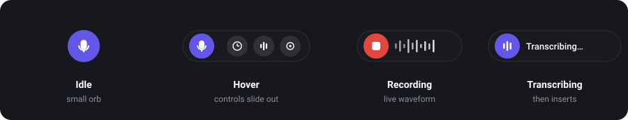

# Speak: a Wispr Flow-like dictation app for macOS

Hold a hotkey, talk, let go. Speak transcribes what you said, cleans it up, and pastes
it wherever your cursor is, in **any app**. It's a native macOS menu-bar app with an
[agno](https://docs.agno.com) / AgentOS backend.

- Speech to text with OpenAI `gpt-4o-transcribe`.
- Cleanup by a small agno agent (`gpt-4.1-mini`) that drops the "um"s, fixes
  punctuation, and turns spoken commands like "new line" or "period" into real formatting.
- Insertion that finds the focused field (or the nearest one to your pointer) and pastes.

> Both models are swappable, and honestly worth playing with. The cleanup one especially:
> a cheaper model like `gpt-4.1-nano` handles the formatting just fine and is faster. See
> [Swap the models](#swap-the-models) below.

## How it works



The whole UI is one small floating pill. It sits as an orb, expands when you hover, and
turns into a live waveform while you talk.



## Repo layout

| Path | What |
|------|------|
| `agents/dictation.py` | The cleanup agent (formatting-only instructions) |
| `workflows/dictation.py` | 2-step agno Workflow: transcribe, then clean |
| `app/dictation_api.py` | `POST /dictation/transcribe` (audio in, text out) |
| `app/main.py` | AgentOS setup and the shared-secret gate |
| `mac-app/` | The native Swift menu-bar app |

## Prerequisites

- Backend: [Docker](https://www.docker.com/) and an OpenAI API key.
- Mac app: macOS 13+ and Xcode Command Line Tools (`xcode-select --install`). No full
  Xcode required.

## 1. Run the backend (local)

```bash
cp example.env .env
# open .env and set OPENAI_API_KEY=sk-...your real key...
docker compose up -d
```

Check it's up: `curl http://127.0.0.1:8000/dictation/health` should return
`{"status":"ok",...}`. Interactive API docs live at http://127.0.0.1:8000/docs.

> Want to host it so others can use it? See **[DEPLOY_RAILWAY.md](DEPLOY_RAILWAY.md)**.

## 2. Build and run the Mac app

```bash
cd mac-app
./setup_signing.sh    # run once; sets up a stable local signing identity so grants stick
./build_app.sh        # compiles and assembles Speak.app
open Speak.app
```

A microphone icon shows up in the menu bar.

On first launch you'll grant two permissions:

1. Microphone. You'll be prompted the first time you dictate.
2. Accessibility. Needed both for the hotkey and to paste into other apps. Turn on
   **Speak** under System Settings › Privacy & Security › Accessibility, then relaunch.
   (Right-click the menu-bar icon and pick "Check Permissions…" to see the status.)

Then put your cursor in any text field, hold Right Option, talk, and let go.

## 3. Point the app at your backend (if hosted)

Right-click the menu-bar icon, open **Server settings…**, and set the backend URL
(`https://…`) plus the access token (it has to match `SPEAK_ACCESS_TOKEN` on the
server). Running locally, you don't need either.

## Controls

- Hold Right Option to dictate (push-to-talk).
- Left-click the menu-bar icon for the history panel (search, click to re-copy).
- Right-click for controls: dictation toggle, the floating pill, Language (Auto,
  English, Hindi, and more), Server settings, and permissions.
- The floating pill is a small orb that expands on hover and becomes the waveform while
  recording.

## Swap the models

It's open source, so try whatever you want. Both models are a single env var each, and
swapping them is the easiest thing to experiment with. The cleanup model in particular
doesn't need to be big.

| Env var | Default | What it does | Worth trying |
|---|---|---|---|
| `DICTATION_TRANSCRIBE_MODEL` | `gpt-4o-transcribe` | Speech to text | `gpt-4o-mini-transcribe` (faster, cheaper) |
| `DICTATION_CLEANUP_MODEL` | `gpt-4.1-mini` | Cleanup and formatting | `gpt-4.1-nano` (lowest latency) |

Set them in `.env` (or in your host's variables) and restart:

```bash
DICTATION_TRANSCRIBE_MODEL=gpt-4o-mini-transcribe
DICTATION_CLEANUP_MODEL=gpt-4.1-nano
```

Want a different provider altogether? The cleanup step is a normal agno agent in
`agents/dictation.py`, so swap `OpenAIChat` for Claude, Gemini, or a local Ollama model
(see [agno models](https://docs.agno.com/models)). The transcribe step is a plain
function in `workflows/dictation.py`, so you can point it at Deepgram, Groq Whisper, or a
local `faster-whisper` instead. Since the pipeline is a two-step agno Workflow, adding
more steps later (language detection, per-app tone, custom vocabulary) is just another
`Step`.

Tip: send `clean=false` and you get the raw transcript back, which lets you judge the
speech-to-text quality on its own, separate from the cleanup model.

## Download (no build)

Grab `Speak.dmg` from the [Releases](../../releases) page and drag Speak into
Applications. The app is self-signed right now, so a downloaded copy gets quarantined by
macOS. Clear that once:

```bash
xattr -dr com.apple.quarantine /Applications/Speak.app
```

For a clean download with no bypass, the app needs an Apple Developer ID and notarization.

## Notes

- The `/dictation/transcribe` route exists because the input is a binary audio upload,
  which the generic agno run/workflow endpoints don't take. It also keeps your OpenAI key
  on the server.
- Every cleanup run is saved to Postgres (you can see them under `/sessions` and at
  [os.agno.com](https://os.agno.com)).
- Built on the [agentos-docker](https://github.com/agno-agi/agentos-docker) template.
